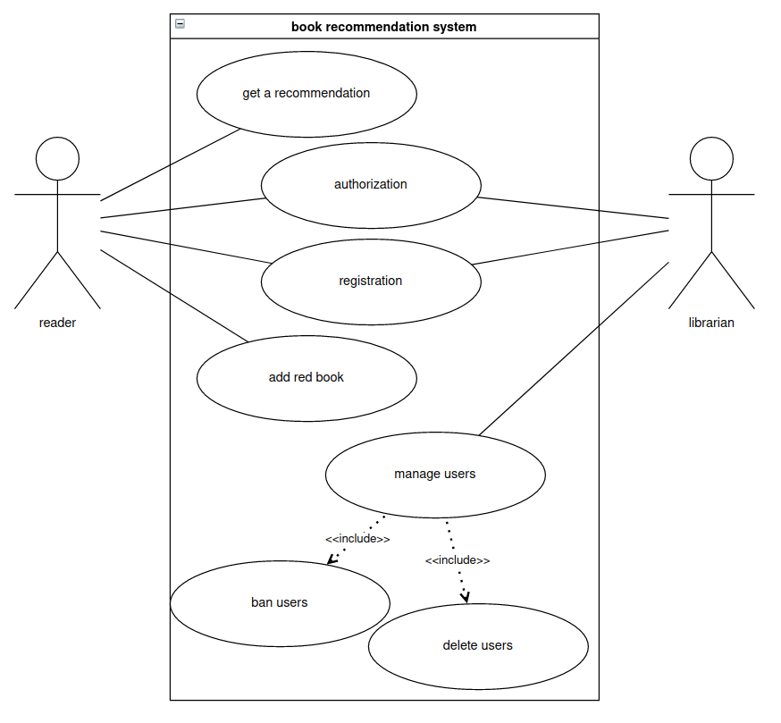

# Введение в веб разработку
1. [Паттерны проектирования](#design_patterns)
2. [Python фреймворки для веб-разработки](#python_frameworks)
3. [Создание простого приложения на Flask](#flask_base)

## <a name="design_patterns"> Паттерны проектирования </a>
### Зачем это надо:

Недостаточно просто написать работающее приложение, его так же нужно будет поддерживать и расширять. Для этого и существуют паттерны проектирования. Паттерны это свод правил, а просто рекомендации, которые помогут проектировать поддерживаемые системы.


### Как понимать паттерны:
Паттерны не привязаны к конкретному языку или технологии. Паттерны применимы во всех ООП языках, и, чтобы их понимать, без привязки к конкретному ЯП, нужно овладеть унифицированным языком моделирования(Unified Modeling Language).
Существует несколько видов диаграм UML, самые ключевые из них это: диаграмма вариантов использования, диаграмма активности и диаграмма классов.

Разберем три этих диаграммы на примере небольшого описания приложения: *система для подбора книг, в котором книги для читателя подбираются по его предпочтениям*
#### Диаграмма вариантов использования
самая общая диаграмма, показывает какие возможности доступны актору(пользователю) в системе. В диаграмме вариантов использования(как и в любой другой диаграмме) незья использовать просто абстрактные сущности типа User, всегда нужно знать, о ком система, потому в нашем примере это могут быть читатель(Reader) и Библиотекарь(Librarian). Из описания приложения можно выделить исколько случаев использования:

Reader:
1. Подбор книги(get a recommendation) - приложение дожно рекомендовать книги пользователю
2. Регистрация(registration) - книги и рекомендации должны привязываться к кому-то
3. Авторизация(authorization) - пользователь должен иметь доступ к своим книгам и рекомендациям
4. Добавление книги(add a book) - рекомендации пользователю составляются на основе уже прочитанных книг

Librarian:
1. Удалять читателей
2. Банить читателей

На основании возможностей системы, можно составить диаграмму варинантов использования:



### Наиболее распространенные паттерны:
Для наглядности применения паттернов придумаем новое приложение. Пусть это будет симулятор машин. Есть разные машины, у которых есть разное поведение, например легковые машины не могут перевозить так много груза как грузовые, а гоночные машины ездят быстрее чем легковые([Исходник](./core/0_cars.py)).

Применить или нет определенный паттерн проектирования, зависит от задачи и контекста, нельзя выделить какой-то набор паттернов и сказать, что от этого ваше приложение станет лучше или хуже, однако можно выделить наиболее распространенные паттерны:
- [фабричный метод(factory method)](./core/factory_method.py) - основная идея в том, чтобы разделить создание объектов и их использование. Ответственность за создание объектов переходит на другие объекты, которые имеют общий интерфейс. Помогает легко вводить новые зависимости в код, не привязываясь к конктретным объектам в нем. Например в приложении с машинами могут добавиться машины других видов, и теперь во всей бизнес-логике нужно будет их заменять, это отяготит наш код и сделает много бесполезных условных операций. Применяя фабричный метод, мы вводим только одну зависимость, на *моменте создания пораждающего класса*.

- [абстрактная фабрика(abstract factory)](./core/design_patterns/abstract_factory.py) - так же порождающий шаблон, необходимый для разделения части создания объекта, от его использования. В отличае от фабричного метода, групперует порождение объектов с *одинаковым контекстом в один порождающий класс*.

- [одиночка(singleton)](./core/design_patterns/singleton.py) - паттерн гарантирует, что создаваемый объект будет только один во всей программе, используется для коннекшена с БД или другими резурсозатратными операциями. Необходимо применять очень осторожно, т.к. может стать [божественным классом](https://ru.wikipedia.org/wiki/%D0%91%D0%BE%D0%B6%D0%B5%D1%81%D1%82%D0%B2%D0%B5%D0%BD%D0%BD%D1%8B%D0%B9_%D0%BE%D0%B1%D1%8A%D0%B5%D0%BA%D1%82)
- [стратегия(strategy)](./core/design_patterns/strategy.py) - позволяет выделить алгоритм в отдельную сущность и менять его в зависимости от необходимости. Применятся в случаях, если у одинаковых классов много общего, но отличается только олгоритм. Логику этого алгоритма можно вынести в отдельные классы, а классы-исходники слить в один.
- [шаблонный метод(template method)](./core/design_patterns/template_method.py) - поведенческий паттерн, позволяет указать в абстрактном классе последовательность действий этого класса. По сути может оказаться так, что почти вся логика может быть реализованна в абстрактном классе, а истинно абстрактным методом останется только один или два небольших, которые можно реализовать в классах-потомках.

Применять паттерны стоит очень осторожно, часто, они и вовсе непосредно не применяются, однако могут быть такие проекты, в которых применение паттернов необходимо.

Русурсы:
- [Сайт с разбором 23х классических паттерна проектирования](https://refactoring.guru/ru)
- [Design Patterns - книга, впервые описывающая паттерны проектирования](https://oz.by/books/more101783.html)


### <a name="python_frameworks"> Python фреймворки для веб-разработки</a>
Общий обзор некоторых Python-фреймворков:
- Django - старый и надежный фреймворк, предоставляет множество функций из коробки. Имеет готовую структуру, в которую нужно только поместить необходимое взаимодействие. Строится по MVT подобию, предоставляет множество инструментов, но из-за своего большого размера, очень медленно развивается.
- Flask - мини-фреймворк на Python. Предоставляет только самые необходимые функции, как правила проекты на Flask более сложные чем на Django, так как этот фреймворк обычно выбирают для систем со своей архитектурой и иногда сложно адаптироваться к архитектуре, которую предоставляет проект. Однако, довольно часто эти архитектуры сводятся к той же архитектуре Django.
- FastApi - совсем молодой фреймворк, предоставляющий асинхронное взаимодействие, основан на Flask и сразу запал программистам в сердце из-за обязательного указания типов в функциях и классах. Фреймворк намного быстрее своих собратьев, но архитектуру нужно придумывать самому.

### <a name="flask_base"> Создание простого приложения на Flask</a>
Для написания простого приложения на Flask необходио сделать несколько простых шагов(файл будет называться app.py):
1. Подключить саму библиотеку Flask:
    ```py
    from flask import Flask
    ```
2. Создать само приложние Flask. Это объект-синглтон, то есть он может быть создан только один раз за приложение. Для его создания необходимо передать название приложние, к нему можно получить доступ используя переменную `__name__`:
    ```py
    app = Flask(__name__)
    ```
3. Используя декоратор, который предоставляет синглтон приложения Flask, написать простой путь к функции, которая должна обработать запрос:
    ```py
    @app.route("/")
    def hello_world():
        return "<p>Hello, World!</p>"
    ```
Итого, все приложение будет выглядеть следующим образом:
```py
from flask import Flask

app = Flask(__name__)

@app.route("/")
def hello_world():
    return "<p>Hello, World!</p>"
```
Далее, чтобы запустить приложение можно написать в консоле:
```
flask run
```
Это откроет приложение на порту 5000, вашего устройства в браузере.

Кроме того можно кастомезировать url нашего приложения и брать оттуда данные, например:

```py
from flask import Flask

app = Flask(__name__)

@app.route("/<name>")
def hello_world(name):
    return f"<p>Hello, {name}!</p>"
```

Однако, как же нам принимать и обрабатывать запросы? Данные переданные в запросе приложению хранятся в объекте-синглтоне `request`. Чтобы его использовать, нужно просто подключить этот объект к своему приложениею:
```py
from flask import request
```
Далее можно добавить еще возможностей в наш обработчик:
```py
from flask import Flask
from flask import request

app = Flask(__name__)

@app.route("/<name>")
def hello_world(name):
    age = request.args.get("age", '')
    surname = request.args.get("surname", '')
    return f"<p>Hello, {name} {surname}! Your age is {age}</p>"
```
На этом пожалуй все, об основах.

